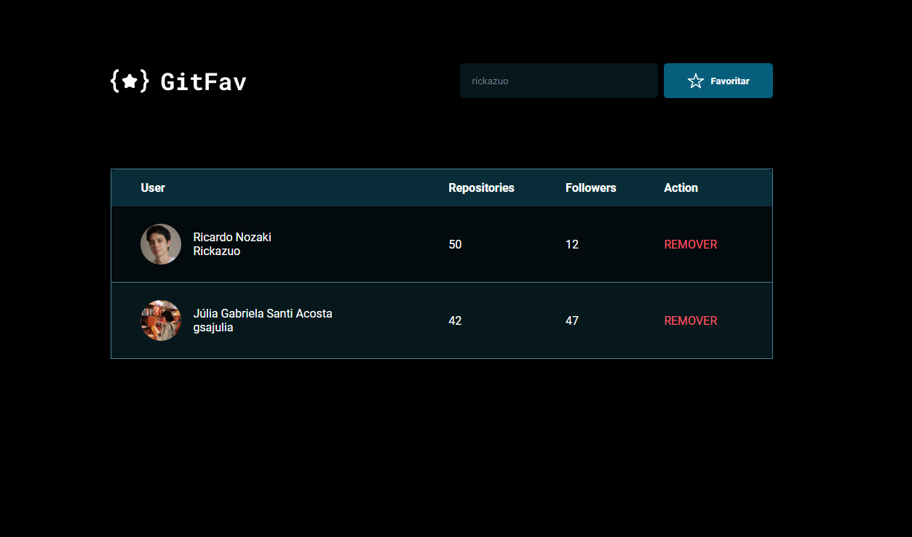

<h1 align="center"> Desafio Página GitFav </h1>

Uma página para favoritar os perfis do Github - RocketSeat 

  <a href="#-tecnologias">Tecnologias</a>&nbsp;&nbsp;&nbsp;|&nbsp;&nbsp;&nbsp;
  <a href="#-projeto">Projeto</a>&nbsp;&nbsp;&nbsp;|&nbsp;&nbsp;&nbsp;
  <a href="#-collaborators">Colaborador</a>&nbsp;&nbsp;&nbsp;

 

  

## 🚀 Tecnologias

Esse projeto foi desenvolvido com as seguintes tecnologias:

- HTML
- CSS
- Git e Github

## 💻 Projeto

O projeto _GitFav_ foi realizado como parte do curso de desenvolvimento de software da <a href="https://www.rocketseat.com.br/" alt="Link para o site da RocketSeat" target="_blank">RocketSeat</a>.

_<h2 align="center" ><a href="https://rickazuo.github.io/fase-03-Explorer--formulario-alternativo/" target="_blank">Visite o projeto online</a></h2>_

## 📃 Colaborador

This challange was made by [Ricardo](https://rickazuo.github.io/portfolio/).
